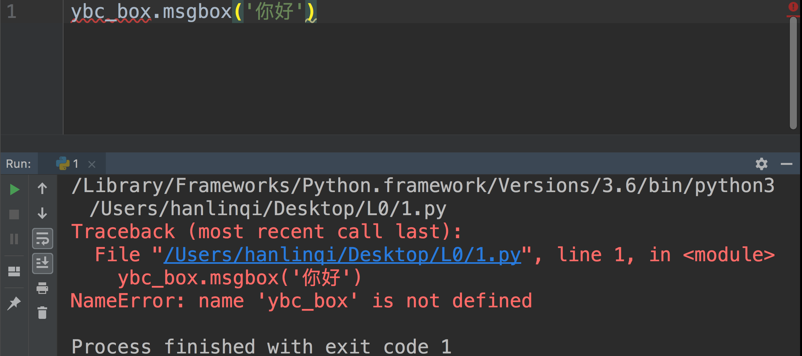

UNIT02 让Python开口说话
##################################

模块
***********************************************************************

没有导入模块直接使用模块
=======================================================================================

**代码示例：**

**定位问题：** （ \ `详情 <../../question/NameError.html#id4>`_ ）

第1行： 没有导入ybc_box模块。

模块名写错或者模块没有安装
=======================================================================================

**代码示例：**

.. image:: ../../_static/image/L0/UNIT02/2.png

**定位问题：** （ \ `详情 <../../question/ModuleNotFoundError.html#id1>`_ ）

第1行： ybcbox模块名称写错或者没有安装此模块。

方法不存在错误
=======================================================================================

**代码示例：**

.. image:: ../../_static/image/L0/UNIT02/3.png

**定位问题：** （ \ `详情 <../../question/AttributeError.html#id2>`_ ）

第2行： 方法名拼写错误或者不存在这个方法。

模块别名
=======================================================================================

**代码示例：**

.. image:: ../../_static/image/L0/UNIT02/4.png

**定位问题：** （ \ `详情 <../../question/NameError.html#id3>`_ ）

第2行： ybc_speech模块起了别名，就只能通过起的别名speech调用属性。

模块方法调用图片，图片名错误
=======================================================================================

**代码示例：**

.. image:: ../../_static/image/L0/UNIT02/5.png

第3行： ybc_box模块第二个参数，图片格式拼写错误。